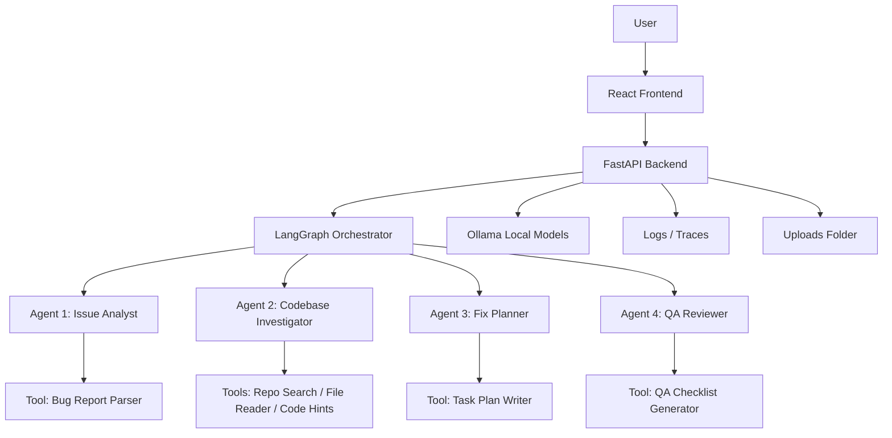
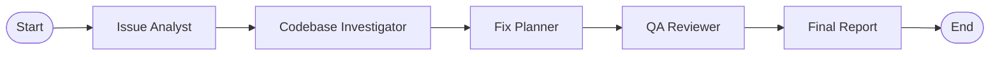
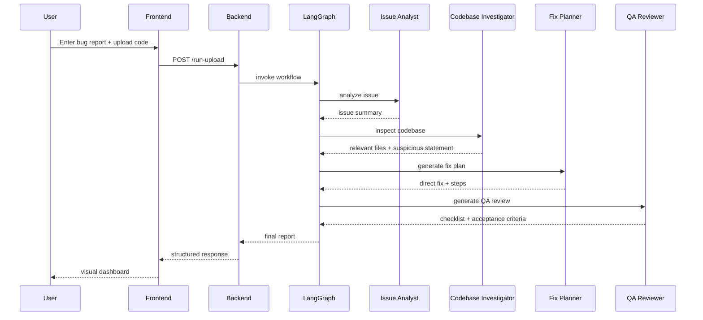

# Multi-Agent Bug Triage System

A locally hosted **Multi-Agent System (MAS)** for software bug investigation, built for the **SE4010 – CTSE Assignment 2 – Machine Learning** coursework.

This project uses **Ollama-hosted local Small Language Models (SLMs)** and a real **LangGraph** workflow to analyze bug reports, inspect uploaded codebases, suggest direct fixes, and generate QA validation steps.

---

## Project Overview

The system is designed as an **autonomous team of 4 agents** that collaborate to solve a multi-step software engineering problem:

- understand a bug report
- search a codebase
- identify the most likely root cause
- propose a fix
- generate QA checks and acceptance criteria

Unlike a generic chatbot, this system performs structured agent orchestration, uses custom Python tools, preserves shared state between agents, and records execution traces for observability.

---

## Problem Domain

This project focuses on the **Software Engineering / Bug Triage** domain.

### Problem addressed
Developers often receive bug reports in natural language, but identifying the root cause inside a codebase can be slow and repetitive. This system helps automate early-stage bug triage by:

- parsing the issue description
- inspecting the uploaded codebase
- identifying the likely problematic file and statement
- generating a structured fix plan
- producing QA validation steps

---

## Key Features

- **Local execution only**
  - runs fully on local machine
  - no paid APIs
  - no OpenAI / Anthropic / cloud LLM dependency

- **Real multi-agent orchestration using LangGraph**
  - 4 distinct agents
  - shared state passed across agents
  - compiled LangGraph `StateGraph`

- **Codebase upload support**
  - upload a `.zip` codebase
  - upload a single file such as:
    - `.py`
    - `.js`
    - `.jsx`
    - `.ts`
    - `.tsx`
    - `.json`

- **Frontend UI**
  - issue description form
  - upload-based workflow
  - results dashboard
  - badges, shortened paths, quick summary, trace display

- **Agent observability**
  - run-level logs
  - per-agent input/output logs
  - per-tool call logs
  - workflow summary logs

- **Automated testing**
  - per-agent test coverage
  - end-to-end LangGraph workflow evaluation
  - LangGraph verification script

---


## System Architecture

The system uses a **sequential multi-agent pipeline** implemented through **LangGraph**.



### Agents

#### 1. Issue Analyst
Responsible for:
- parsing the bug report
- determining severity
- producing structured issue summary
- defining expected behavior and investigation focus

#### 2. Codebase Investigator
Responsible for:
- searching the uploaded repository
- reading file excerpts
- extracting rule-based code hints
- identifying the most relevant file and suspicious statement

#### 3. Fix Planner
Responsible for:
- analyzing the investigation findings
- generating a direct fix recommendation
- producing implementation steps
- producing regression checks

#### 4. QA Reviewer
Responsible for:
- generating QA checklist
- acceptance criteria
- regression risks
- final QA decision
---

## Agent Workflow



## LangGraph Workflow

This project now uses a **real LangGraph workflow**, not just a simple sequential Python function.

### Workflow nodes
- `issue_analyst`
- `codebase_investigator`
- `fix_planner`
- `qa_reviewer`
- `finalize_report`

### Workflow edges
- `START -> issue_analyst`
- `issue_analyst -> codebase_investigator`
- `codebase_investigator -> fix_planner`
- `fix_planner -> qa_reviewer`
- `qa_reviewer -> finalize_report`
- `finalize_report -> END`

---
## Example Execution Sequence



## State Management

The system uses a shared global state object called `GraphState` to preserve context between agents.

### State fields
- `run_id`
- `user_input`
- `project_path`
- `issue_summary`
- `relevant_files`
- `code_findings`
- `fix_plan`
- `qa_report`
- `final_report`
- `trace`

This ensures that each agent receives the outputs of previous agents without losing context.

---

## Observability / Logging

The system includes **LLMOps / AgentOps style logging** to record the execution flow.

### What is logged
For each run, the system records:
- agent start events
- tool calls
- tool inputs
- tool outputs
- agent outputs
- workflow summary

### Log files
- `backend/logs/agent_steps.log`
- `backend/logs/run_trace.jsonl`
- `backend/logs/runs/<run_id>.jsonl`

### Example logged event types
- `agent_start`
- `tool_call`
- `agent_end`
- `workflow_summary`

This satisfies the assignment requirement for recording specific agent inputs, tool calls, and outputs.

---

## Custom Tools

The project includes custom Python tools that agents use during execution.

### Member 1 – Issue Analyst Tool
- `tool_bug_report_parser.py`
  - parses bug report text
  - extracts severity / issue metadata

### Member 2 – Codebase Investigator Tools
- `tool_repo_search.py`
  - searches repository files by weighted keyword relevance
- `tool_file_reader.py`
  - reads safe file excerpts
- `tool_code_hints.py`
  - extracts rule-based code hints

### Member 3 – Fix Planner Tool
- `tool_task_plan_writer.py`
  - generates initial implementation step seeds

### Member 4 – QA Reviewer Tool
- `tool_qa_checklist.py`
  - generates QA checklist seeds

All tools are custom Python implementations and are used by agents during real execution.

---

## Tech Stack

### Backend
- Python 3.12
- FastAPI
- Pydantic
- Uvicorn
- LangGraph
- LangChain
- langchain-ollama
- Ollama

### Frontend
- React
- Vite
- Tailwind CSS v4
- Axios
- React Router
- Lucide React

### Models
- Ollama local models, for example:
  - `llama3.1`
  - `phi3`

---

## Project Structure

```text
multi-agent-bug-triage/
├── backend/
│   ├── app/
│   │   ├── agents/
│   │   │   ├── member1_issue_analyst/
│   │   │   ├── member2_codebase_investigator/
│   │   │   ├── member3_fix_planner/
│   │   │   └── member4_qa_reviewer/
│   │   ├── api/
│   │   │   └── routes.py
│   │   ├── orchestrator/
│   │   │   ├── graph.py
│   │   │   └── workflow.py
│   │   ├── shared/
│   │   │   ├── llm.py
│   │   │   ├── logger.py
│   │   │   ├── models.py
│   │   │   └── upload_utils.py
│   │   ├── config.py
│   │   ├── main.py
│   │   └── state.py
│   ├── data/
│   │   ├── sample_projects/
│   │   └── uploads/
│   ├── logs/
│   │   └── runs/
│   ├── requirements.txt
│   ├── run.py
│   └── verify_langgraph.py
├── frontend/
│   ├── src/
│   │   ├── components/
│   │   ├── pages/
│   │   ├── services/
│   │   ├── App.jsx
│   │   ├── main.jsx
│   │   └── index.css
│   ├── package.json
│   └── vite.config.js
└── README.md
```

## Prerequisites

Before running the project, make sure you have:

- **Python 3.12+**
- **Node.js / npm**
- **Ollama installed**
- at least one local model pulled in Ollama

### Example Ollama models

```bash
ollama pull llama3.1
ollama pull phi3
```

You can check installed models with:

```bash
ollama list
```

---

## Backend Setup

### 1. Go to backend
```bash
cd backend
```

### 2. Create virtual environment
```bash
python -m venv venv
```

### 3. Activate virtual environment

#### Windows PowerShell
```bash
.\venv\Scripts\Activate.ps1
```

#### Windows CMD
```bash
venv\Scripts\activate
```

### 4. Install dependencies
```bash
pip install -r requirements.txt
```

### 5. Create `.env`
Create a file named `.env` inside `backend/` and add:

```env
APP_NAME=Multi-Agent Bug Triage
APP_ENV=development
APP_HOST=127.0.0.1
APP_PORT=8000

OLLAMA_BASE_URL=http://localhost:11434
COORDINATOR_MODEL=llama3.1
WORKER_MODEL=phi3

LOG_DIR=logs
UPLOAD_DIR=data/uploads
SAMPLE_PROJECTS_DIR=data/sample_projects
MAX_FILE_READ_CHARS=12000
```

### 6. Start backend
```bash
python run.py
```

### 7. Open API docs
```text
http://127.0.0.1:8000/docs
```

---

## Frontend Setup

### 1. Go to frontend
```bash
cd frontend
```

### 2. Install dependencies
```bash
npm install
```

### 3. Start frontend
```bash
npm run dev
```

### 4. Open frontend
```text
http://localhost:5173
```

---

## Running the Application

### Main user flow
1. Open the frontend
2. Enter a bug description
3. Upload either:
   - a `.zip` codebase
   - or a single supported code file
4. Click **Run analysis**
5. Review:
   - Issue Summary
   - Relevant Files
   - Code Findings
   - Fix Plan
   - QA Report
   - Agent Trace

---

## Supported Upload Types

### ZIP uploads
Recommended for full codebases.

Supported:
- `.zip`

### Single code file uploads
Supported:
- `.py`
- `.js`
- `.jsx`
- `.ts`
- `.tsx`
- `.json`

---

## API Endpoints

### `GET /health`
Checks backend health.

### `POST /run`
Runs analysis using direct JSON input.

Request body:
```json
{
  "user_input": "Login fails and the app crashes after entering wrong credentials.",
  "project_path": "path/to/project"
}
```

### `POST /run-upload`
Runs analysis using uploaded file.

Multipart form data:
- `user_input`
- `codebase_file`

---

## LangGraph Verification

This repository includes a verification script to prove that the orchestration uses a real LangGraph graph.

### Run verification
```bash
cd backend
python verify_langgraph.py
```

### Expected result
You should see:
- `CompiledStateGraph`
- graph Mermaid output
- successful workflow execution
- `LANGGRAPH CHECK PASSED`

---

## Testing / Evaluation

The project includes automated tests for:
- agent tools
- agent outputs
- QA logic
- end-to-end LangGraph workflow execution

### Run all tests
```bash
cd backend
pytest
```

### Current automated coverage includes
- Issue Analyst tests
- Codebase Investigator tests
- Fix Planner tests
- QA Reviewer tests
- LangGraph workflow evaluation

---

## Example Test Scenario

### Input
Bug report:
```text
Login fails and the app crashes after entering wrong credentials.
```

### Code issue example
```python
return result["message"]
```

### Expected system behavior
- identify `login_handler.py`
- detect likely `NameError`
- point to suspicious statement
- suggest direct replacement:

```python
return {"success": False, "message": "Invalid credentials"}
```

---

## Observability Demo

After a run, inspect:

```text
backend/logs/run_trace.jsonl
backend/logs/runs/<run_id>.jsonl
```

Each run log contains records such as:

```json
{"event_type":"agent_start", "...":"..."}
{"event_type":"tool_call", "...":"..."}
{"event_type":"agent_end", "...":"..."}
{"event_type":"workflow_summary", "...":"..."}
```

This can be used in the demo video and technical report to prove observability.

---

## Frontend Pages

### Home Page
- issue description form
- code upload control
- upload mode guidance
- workflow summary

### Result Page
- submitted input
- issue summary
- relevant files
- code findings
- fix plan
- QA report
- upload details
- quick summary
- agent trace

---

## Contribution Mapping

Each team member is expected to contribute:
- one agent
- one tool
- one testing/evaluation script

### Suggested mapping

| Member | Agent | Tool | Test File |
|---|---|---|---|
| Member 1 | Issue Analyst | `tool_bug_report_parser.py` | `test_issue_analyst.py` |
| Member 2 | Codebase Investigator | `tool_repo_search.py`, `tool_file_reader.py`, `tool_code_hints.py` | `test_codebase_investigator.py` |
| Member 3 | Fix Planner | `tool_task_plan_writer.py` | `test_fix_planner.py` |
| Member 4 | QA Reviewer | `tool_qa_checklist.py` | `test_qa_reviewer.py` |

---

## Technical Report Checklist

The report should include:

- problem domain
- system architecture
- multi-agent architecture
- workflow diagram
- agent roles and responsibilities
- prompts / constraints / reasoning logic
- description of custom tools
- tool usage examples
- state management explanation
- evaluation methodology
- testing scripts
- performance / reliability discussion
- GitHub repository link
- individual contribution proof
- challenges faced by each team member

---

## Demo Video Checklist

Recommended 4–5 minute demo structure:

1. project intro
2. show frontend
3. show upload workflow
4. run a sample bug report
5. show generated outputs
6. show LangGraph verification
7. show logs / observability
8. show tests running

---

## Screenshots

You can add screenshots here before final submission.

### Suggested screenshots
- Home page
- Upload form
- Result page
- LangGraph verification output
- Logs folder / run log file
- Pytest passing output

---

## Troubleshooting

### Ollama model not responding
Make sure Ollama is running:
```bash
ollama list
```

### Frontend cannot call backend
Check:
- backend is running on `127.0.0.1:8000`
- frontend is running on `localhost:5173`
- CORS is enabled in backend

### Import errors in VS Code
Make sure VS Code interpreter is set to:
```text
backend/venv/Scripts/python.exe
```

### Upload not working
Make sure uploaded file type is supported:
- `.zip`
- `.py`
- `.js`
- `.jsx`
- `.ts`
- `.tsx`
- `.json`

### Tests are failing
Run:
```bash
cd backend
pytest
```

and confirm Ollama is running if the tests exercise LLM-backed agent behavior.

---

## Repository Link

Add your repository link here:

```text
<PASTE_YOUR_GITHUB_OR_GITLAB_REPOSITORY_LINK_HERE>
```

---

## Academic Note

This project was developed for academic coursework and is intended to demonstrate:
- local multi-agent orchestration
- agent-tool interaction
- shared state management
- observability / tracing
- automated testing / evaluation

---

## Project Highlights

| Item | Value |
|---|---|
| Agents | 4 |
| Orchestration | LangGraph |
| Models | Ollama local SLMs |
| Upload Modes | ZIP + single file |
| Backend | FastAPI |
| Frontend | React + Vite |
| Tests | 17 passing |
| Logging | Run trace + per-run JSONL |

## License

This repository is for educational use unless otherwise specified by the project team.
